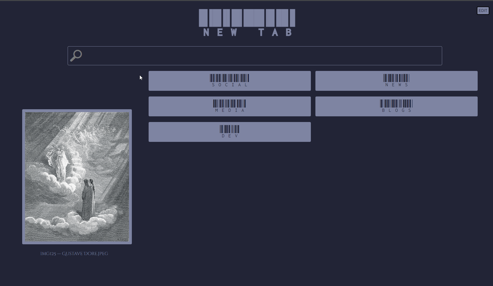

# Tabitha
##### _Customizable New Tab Page_
##### &nbsp;
 >Tabitha (/ˈtæbɪθə/) is an English feminine given name, originating with (or made popular through) Saint Tabitha, mentioned in the New Testament.
 
 ✨It's also a random name I picked for my custom new tab page✨
## Features
- autofocus search/address input
- custom pinned sites seperated into collapsible categories
- custom images displayed in slideshow
- editor for changing custom sites and images
- option to use remote json file for shared configuration
- settings are stored in browsers localStorage, no external services

## Access
Tabitha is deployed to GitHub Pages

## Notes
You can use a browser extension to synchronize your settings between browsers:
 - [Simple Storage Sync](https://github.com/andrewiankidd/simple-storage-sync)